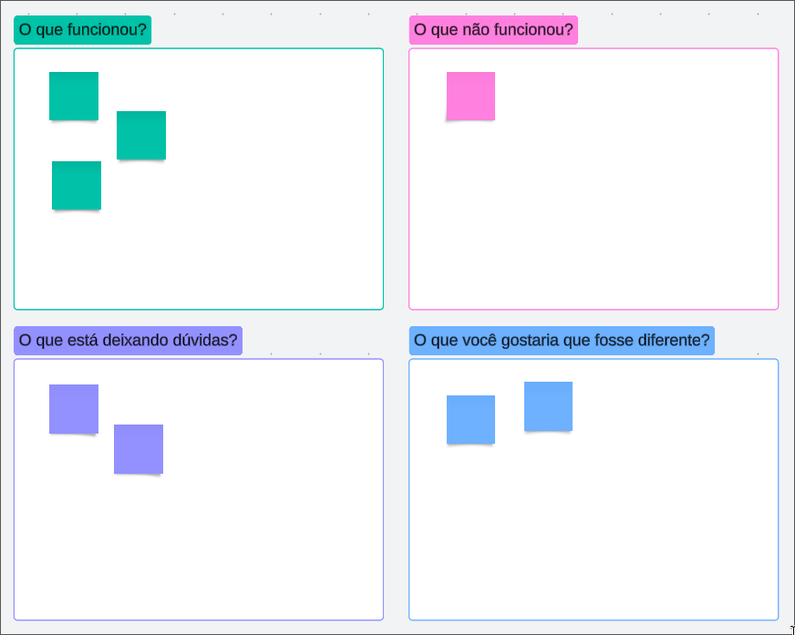
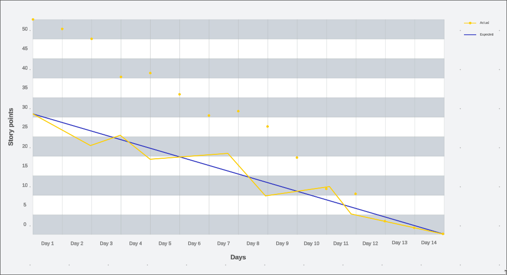

# Cazador - Ache Imóvel

## Problema

Recentemente, precisei adquirir um imóvel, e vi o quão frustrante é essa tarefa, sites com péssimas navegações, informações desnecessárias, propaganda de produtos que não tinham nada a ver com minha pesquisa e informação fragmentada. Tudo isso dificulta não só a procura mas a comparação de preços, tamanhos e localizações, tornando o processo de compra um verdadeiro inferno.

## Proposta

Cazador irá consolidar as informações de diversos sites em uma única plataforma. O usuário que está procurando um imóvel poderá acessar o Cazador, selecionar a localização, tamanho, preço e outras características relevantes, e o sistema encontrará todos os imóveis que correspondem aos critérios definidos. Tornando a pesquisa mais eficiente e agradável.

Irei fazer o escopo pensando somente em uma equipe da área Tech.

## Escopo do Projeto

### Principais Objetivos

- Imóvel: Propriedades listadas, contendo as informações necessárias
- Usuário: Pessoas que utilizam o sistema para buscar os imóveis
- Busca: Critérios de pesquisa definidos pelos usuários
- Notificação: Representa os alertas configurados pelos usuários

### Regras de Negócio

- Busca Personalizada: Usuário poderá filtrar imóveis com os atributos desejados.
- Atualização de Dados: Os scrapers devem atualizar regularmente as informações para garantir que os dados apresentados sejam recentes
- Comparação de Imóveis: Permitir comparação entre múltiplos imóveis
- Notificações: Os usuários podem configurar alertas para serem notificados quando novos imóveis que correspondem aos seus critérios de busca forem adicionados.

### Usuários

- Sistemas Externos: Sites de listagem de imóveis (coleta de dados)
- Administradores do Sistema: Equipe interna responsável pela manutenção.
- Usuário Finais: Pessoas que procuram imóveis para compra ou aluguel.

### Escopo Interno

- Desenvolvimento de scrapers para coletar dados
- Criação de backend para processar e armazenar as informações
- Desenvolvimento do frontend para a interface do usuário, permitindo buscas e filtros personalizados
- Integração de APIs necessárias para a coleta e apresentação de dados
- Implementação de testes unitários e de integração

### Escopo Externo

- Integração com sistemas externos de listagem de imóveis através de scrapers e APIs
- Coleta e atualização contínua de dados dos sites de terceiros
- Não haverá desenvolvimento de sistema de pagamento ou de gestão de transação financeira (inicialmente).

## Método Ágil

### Metodologia Ágil

Utilizaremos a metodologia Kanban. Esta abordagem permitirá uma gestão visual do fluxo, ajudando a identificar gargalos e melhorar continuamente o processo. O Tech Lead (que tem mais experiência da equipe) participará da etapa de Code Review para garantir a qualidade do código.

### Iterações

Teremos reuniões diárias (dailies) para garantir a comunicação contínua e a transparência do progresso do projeto. Essas reuniões ocorrerão todos os dias e terão duração de 15 minutos.

A cada 15 dias, teremos a retrospectiva(retro). Na retro, discutiremos o que funcionou, o que não funcionou, o que esta deixando dúvidas e o que gostaríamos que fosse diferente, com duração de aproximadamente uma hora.

### Práticas Técnicas

- Testes Unitários: Tendo a garantia de que cada componente do sistema funciona de maneira adequada.
- Testes de Integracão: Garantirã́o que os diferentes modulos do sistema funcionem em conjunto: Garantirã́o que os diferentes modulos do sistema funcionem em conjunto
- Code Review: Todos os MRs serão revisados pelo Tech Lead, garantindo conformidade e qualidade do código.
- Pair Programming: Será adotado somente se for absolutamente necessário

### Equipe

- 3 Desenvolvedores Back End: Responsáveis pelos scrapers e gestão de dados
- 1 Desenvolvedores Front End: Responsável pelo site e integração com API interna.
- 1 DevOps: Responsável pela infraestrutura de IaaS, garantindo escalabilidade.
- 1 Tech Lead: Definirá as tarefas e prioridades iniciais, além de buscar novas tecnologias e bibliotecas para utilização no projeto

Ao adotar o Kanban como metodologia Ágil, pretendemos alcançar um fluxo contínuo e eficiente de desenvolvimento, focando na entrega de valor e na melhora contínua.

## Backlog e Stories

### Estórias

- Prioridade Alta

  - Como um cliente, quero encontrar imóveis de acordo com os filtros e sugestão de restaurantes e lazeres ao redor do bairro para que eu possa tomar a melhor decisão.

- Prioridade Média

  - Como cliente, quero encontrar imóveis de maneira fácil e eficiente para que eu posso comprá-los

Inicialmente o foco será no usuário com a estória de filtros por lazer/restaurantes, uma vez que nenhum outro site oferece tal serviço.

### Backlog

1. Criação de modelos
2. Scraper Inicial: Zap Imóveis, Loft, Imovel Web
3. Frontend Intuitivo: Mobile e Web, foco no mobile

## Estimativa

### Tamanho

Utilizando a técnica do Story Points, chegamos ao seguinte score:

- Prioridade Alta: 8 pontos
- Prioridade Média: 5 pontos
- Prioridade Baixa: 3 pontos

### Duração

Considerando que temos 6 membros, estimamos a capacidade da seguinte forma:

`6 membros x 5 dias por semana = 30 pontos de iteração`

### Backlog

- 1 Prioridade Alta
- 3 Prioridades Médias
- 3 Prioridades Baixas

Poderemos suportar, em média, esses tipos de prioridades por semana (30 pontos), atribuindo obviamente de acordo com a equipe.

### Velocity

Velocity será medida pela capacidade de entrega semanal

- 30 pontos por semana (WIP)

### Limite WIP

- To Do: 10 tarefas
- Doing: 5 tarefas
- Pending: 3 tarefas (Code Review)
- Testing: 5 tarefas
- Production: Ilimitado (Done)

Além das dailies e retro teremos reuniões semanais com o Gerente de Produto, revisando o quadro Kanban para alocar novas stories nos slots livres (baseado no limite do WIP).

### Primeiro Release

Com base na capacidade de entrega e prioridade, planejamos o primeiro release para ocorrer após 4 iterações (4 semanas - 120 pontos).

Utilizaremos um Gantt chart que será atualizado diariamente durante as reuniões diárias, monitorando a quantidade de trabalho restante versus o tempo restante na interação.

